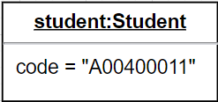

**Scenario Configuration**

|**Name**|**Class**|**Scenario**|
| :-: | :-: | :-: |
|scenario 1|Student||
|scenario 1|Controller||
|scenario 2|Controller||
|scenario 3|Controller||

**Test Cases Design**

|**Test goal:** the Student class constructor assigns correctly the input to the new instance attributes.|||||
| :- | :- | :- | :- | :- |
|**Class**|**Method**|**Scenario**|**Input**|**Output**|
|Student|student|scenario1|Student’s Data|new instance of Student class|

|**Test goal:** the CSV file is localized and the data is read.|||||
| :- | :- | :- | :- | :- |
|**Class**|**Method**|**Scenario**|**Input**|**Output**|
|Controller|loadData()|scenario1|CSV file in a specific location|a File instance representing the CSV file.|

|**Test goal:** the Student ArrayList is filled up with the CSV data.|||||
| :- | :- | :- | :- | :- |
|**Class**|**Method**|**Scenario**|**Input**|**Output**|
|Controller|loadData()|scenario1|a File instance to be red line by line.|The Student ArrayList filled up with the 68 students contained in the CSV file.|

|**Test goal:** registerStudent method to create an instance, and add it to the arraylist of students. |||||
| :- | :- | :- | :- | :- |
|**Class**|**Method**|**Scenario**|**Input**|**Output**|
|Controller|registerStudent()|scenario1|Student’s Data|Create and add a new instance of Student class to the students List.|

|**Test goal:** editStudent method to change a selected attribute of an instance.|||||
| :- | :- | :- | :- | :- |
|**Class**|**Method**|**Scenario**|**Input**|**Output**|
|Controller|editStudent()|scenario2|Student code, which attribute will be changed and its new value.|The instance has its attribute changed.|

|**Test goal:** Catch an exception because the Arraylist is full of nulls.|||||
| :- | :- | :- | :- | :- |
|**Class**|**Method**|**Scenario**|**Input**|**Output**|
|Controller|editStudent()|scenario3|Student code, which attribute will be changed and its new value.|an Exception indicating that the student was not found.|

|**Test goal:** deleteStudent method to remove an specific instance of Student from the students Arraylist.|||||
| :- | :- | :- | :- | :- |
|**Class**|**Method**|**Scenario**|**Input**|**Output**|
|Controller|deleteStudent()|scenario2|Student’s code|the student with the code selected will be deleted from the student list.|

|**Test goal:** check the method response when the students arraylist is empty.  |||||
| :- | :- | :- | :- | :- |
|**Class**|**Method**|**Scenario**|**Input**|**Output**|
|Controller|
generateClassificationReportWithHistrogram

generateClassificationReportWithList

generateChangeStateReportWithHistrogram

generateChangeStateReportWithHistrogram
|scenario1|An empty  arraylist.|An exception indicating that there is no data.|

|**Test goal:** check the method response when the students arraylist contains any null value.|||||
| :- | :- | :- | :- | :- |
|**Class**|**Method**|**Scenario**|**Input**|**Output**|
|Controller|
generateClassificationReportWithHistrogram

generateClassificationReportWithList

generateChangeStateReportWithHistrogram

generateChangeStateReportWithHistrogram
|scenario3|An arraylist with at least one null value.|An exception indicating that the data in the arraylist is type null.|

|**Test goal:** verify that the exported data can be correctly imported again.|||||
| :- | :- | :- | :- | :- |
|**Class**|**Method**|**Scenario**|**Input**|**Output**|
|Controller|exportData()|scenario2|Student Arraylist|A JSON or javacode file is created and stored. |

|**Test goal:** verify that the file exported exists in the storage.|||||
| :- | :- | :- | :- | :- |
|**Class**|**Method**|**Scenario**|**Input**|**Output**|
|Controller|exportData()|scenario2|JSON file|
boolean 

|

